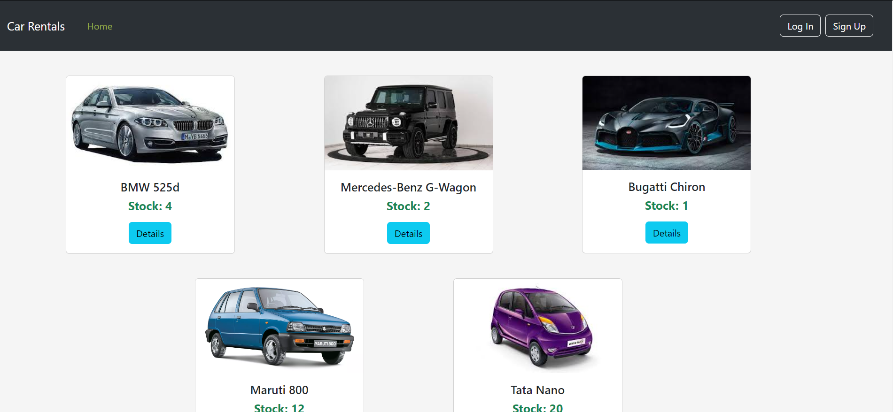
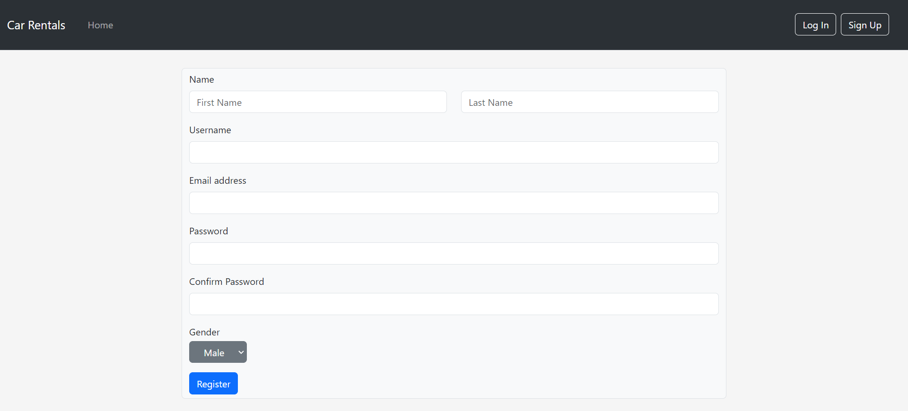
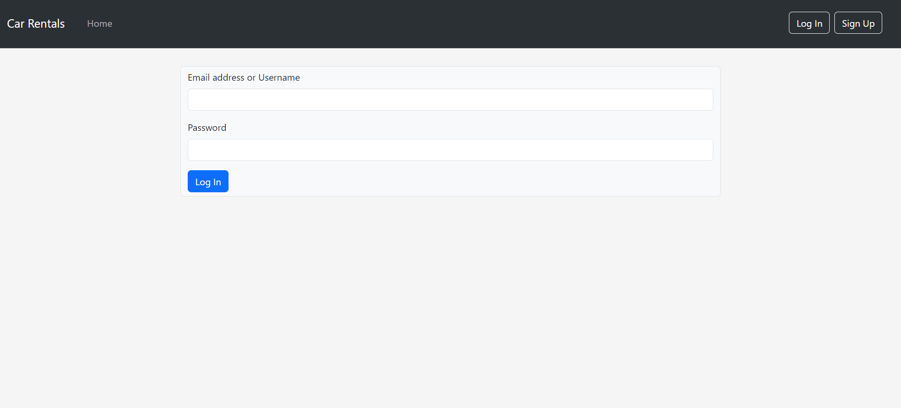
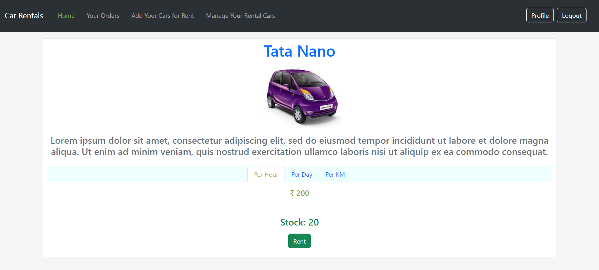
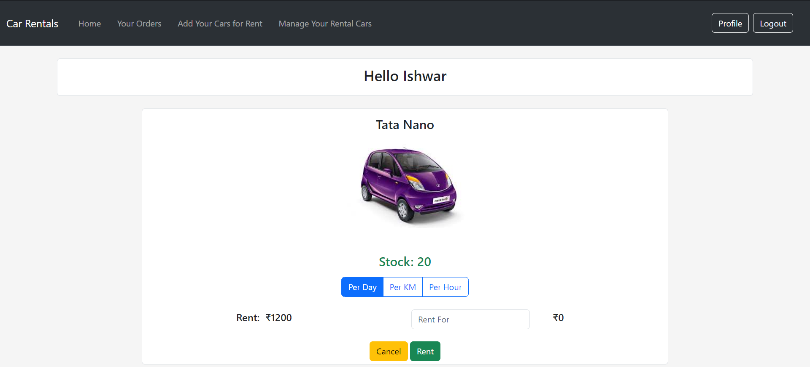
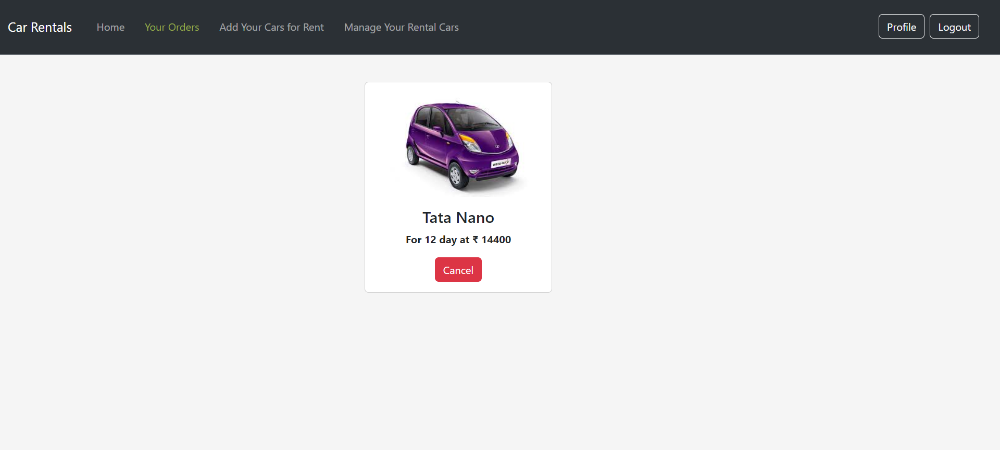
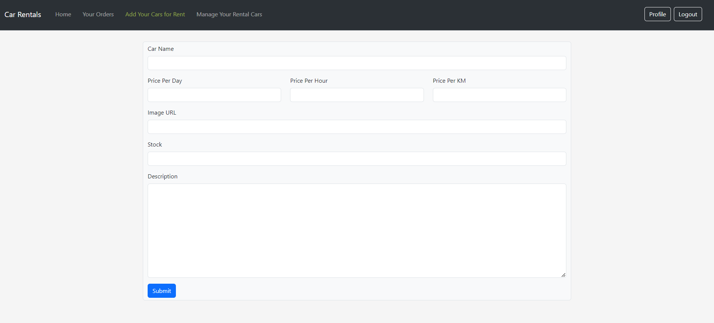
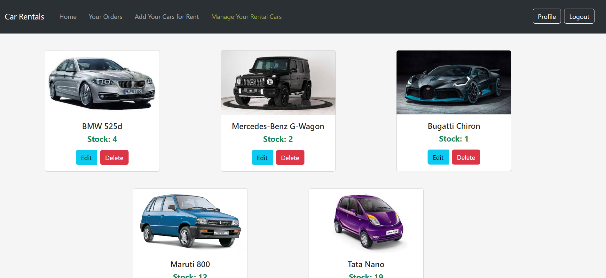
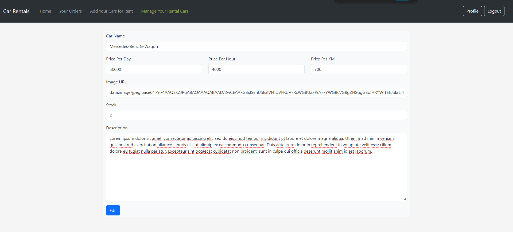
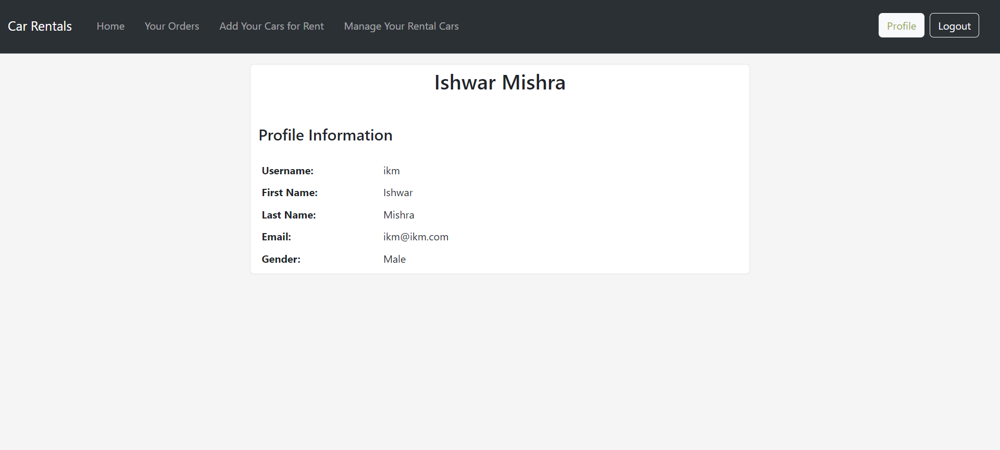

# Car Rental Web Application

This is a web application for car rental services. Users can browse available cars, view car details, place orders, and manage their rentals.

## Features

- **User Authentication:** Users can sign up for an account, log in, and log out securely.
- **Browse Cars:** Users can view a list of available cars for rent.
- **View Car Details:** Users can view detailed information about each car.
- **Rent Cars:** Users can rent cars by specifying the rental duration and payment mode.
- **Manage Rentals:** Users can view their rental history, cancel existing orders, and manage their profile.
- **Add your cars for rental:** Users can view their rental history, cancel existing orders, and manage their profile.

## Technologies Used

- **Node.js:** Server-side JavaScript runtime environment.
- **Express.js:** Web application framework for Node.js.
- **MongoDB:** NoSQL database for storing car, user, and order data.
- **Mongoose:** MongoDB object modeling tool for Node.js.
- **HTML/CSS:** Frontend markup and styling.
- **JavaScript:** Frontend and backend scripting language.
- **EJS:** Templating engine for generating HTML markup.
- **bcryptjs:** Library for hashing passwords securely.
- **express-session:** Middleware for managing user sessions.
- **connect-mongodb-session:** MongoDB session store for Express.js.
- **bcryptjs:** Library for hashing passwords securely.
- **Middleware:** Custom middleware for authorization.

## Setup Instructions

1. Clone the repository:

2. Install dependencies:

   ```bash
   npm install
   ```

3. Set up environment variables:
   - Replace `MONGODB_URI` with your mongodb uri in `app.js` on line 16
   - Replace `SESSION_SECRET`, in `app.js` on line 40

4. Start the server:

   ```bash
   npm start
   ```

5. Access the application in your browser at `http://localhost:3000`.

<br>

## Folder Structure

```
.
├── controllers          # Contains route handler functions
├── middleware           # Contains custom middleware functions
├── models               # Contains Mongoose models
├── public               # Static assets (CSS, images, etc.)
├── routes               # Express route definitions
├── views                # EJS view templates
├── app.js               # Entry point of the application
└── README.md            # Project documentation
```

## Screenshots

### Home Page



### Register Page



### Log-In Page



### Car Details Page



### Rent Page



### Orders Page



### Add your rental Page



### Manage your rental Page



### Rental editing Page



### User Profile Page




<br>
<br>

Feel free to adjust the sections and content according to your project's specific details and requirements.